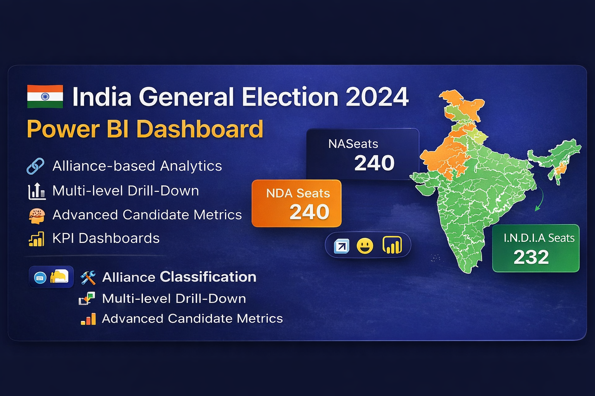

<!-- 🔥 BANNER -->

  

<h1 align="center">🇮🇳 India General Election 2024</h1>
<h3 align="center">📊 Power BI Dashboard Project</h3>

  <b>Transforming India's Largest Democratic Data into Actionable Insights</b>

---

<!-- 🔥 THUMBNAIL -->

  

  

  

  

  

  

---

## 🚀 Project Overview

The <b>India General Election 2024 Reporting System</b> is a Business Intelligence solution designed to analyze complex electoral data using:

<ul>
  <li>✨ Alliance-based performance</li>
  <li>📊 Multi-level analytics (National → State → Constituency)</li>
  <li>🧠 Advanced candidate ranking logic</li>
</ul>

<b>👥 Target Users:</b> Political analysts • Researchers • Policymakers

---

## 🏗 Project Architecture

<table align="center">
  <tr>
    <th>Level</th>
    <th>Description</th>
  </tr>
  <tr>
    <td>🌍 National</td>
    <td>Overall alliance performance</td>
  </tr>
  <tr>
    <td>🏛 State</td>
    <td>Regional political trends</td>
  </tr>
  <tr>
    <td>📍 Constituency</td>
    <td>Candidate-level insights</td>
  </tr>
</table>

---

## 🔗 Alliance Classification

<h3>🟠 NDA Alliance</h3>

BJP, TDP, JD(U), SHS, AJSUP, ADAL, AGP, HAMS, JnP, JD(S), LJPRV, NCP, RLD, SKM

<h3>🟢 I.N.D.I.A Alliance</h3>

INC, AAAP, AITC, CPI(M), CPI, DMK, SP, RJD, JMM, IUML, etc.

<h3>⚪ OTHER</h3>
<ul>
  <li>Independent candidates</li>
  <li>Unlisted parties</li>
</ul>

---

## 🛠 DAX Implementation

<h3>Alliance Mapping</h3>

<pre>
<code>
Party Alliance =
IF(
    partywise_results[Party] IN {
        "Bharatiya Janata Party - BJP",
        "Telugu Desam - TDP",
        "Janata Dal (United) - JD(U)",
        "Shiv Sena - SHS"
    },
    "NDA",
    IF(
        partywise_results[Party] IN {
            "Indian National Congress - INC",
            "Aam Aadmi Party - AAAP",
            "All India Trinamool Congress - AITC"
        },
        "I.N.D.I.A.",
        "OTHER"
    )
)
</code>
</pre>

---

## 🔄 Data Modeling

<pre>
<code>
Party Alliance (Result) =
LOOKUPVALUE(
    partywise_results[Party Alliance],
    partywise_results[Party ID],
    constituencywise_results[Party ID]
)
</code>
</pre>

📌 Additional Fields: Party Name, Party Short Name

---

## 📊 Core KPIs

<h3>🏆 Alliance Seat Count</h3>

<pre>
<code>
NDA Seats =
CALCULATE(
    COUNT(constituencywise_results[Constituency Name]),
    partywise_results[Party Alliance] = "NDA"
)
</code>
</pre>

<pre>
<code>
INDIA Seats =
CALCULATE(
    COUNT(constituencywise_results[Constituency Name]),
    partywise_results[Party Alliance] = "I.N.D.I.A."
)
</code>
</pre>

---

<h3>🥇 Winning Alliance</h3>

<pre>
<code>
Winning Alliance =
VAR NDASeats = [NDA Seats]
VAR INDIASeats = [INDIA Seats]
RETURN IF(NDASeats >= INDIASeats, "NDA", "I.N.D.I.A.")
</code>
</pre>

---

## 🧠 Advanced Analytics

<h3>🥈 Runner-Up Candidate</h3>

<pre>
<code>
Runner UP Candidate =
VAR MaxVotes = MAX(constituencywise_details[Total Votes])
VAR SecondMaxVotes =
    MAXX(
        FILTER(
            constituencywise_details,
            constituencywise_details[Total Votes] < MaxVotes
        ),
        constituencywise_details[Total Votes]
    )
RETURN
    CALCULATE(
        MAX(constituencywise_details[Candidate]),
        constituencywise_details[Total Votes] = SecondMaxVotes
    )
</code>
</pre>

---

<h3>📏 Margin of Victory</h3>

<pre>
<code>
Margin = Winner Votes - Runner-Up Votes
</code>
</pre>

---

## 📊 Dashboard Pages

<ul>
  <li><b>1️⃣ Overview:</b> KPI Cards, Seat Share, Party Matrix</li>
  <li><b>2️⃣ State Analysis:</b> Filled Map & Bubble Map</li>
  <li><b>3️⃣ Political Landscape:</b> Donut Chart & Table</li>
  <li><b>4️⃣ Constituency:</b> Votes & Top Candidates</li>
  <li><b>5️⃣ Detailed Grid:</b> Exportable Data</li>
  <li><b>6️⃣ Landing Page:</b> Navigation Hub</li>
</ul>

---

## 🔁 Interactivity

<ul>
  <li>🔍 Drill-through (State → Constituency)</li>
  <li>🏠 Home Navigation</li>
  <li>🧹 Clear Filters</li>
  <li>📤 Export Data</li>
</ul>

---

## ⚙️ Best Practices

<ul>
  <li>⚡ Use VAR in DAX for performance</li>
  <li>🎨 Clean UI with alliance colors</li>
  <li>📱 Responsive design</li>
</ul>

---

## ⭐ Key Features

✅ Alliance Insights &nbsp;&nbsp;|&nbsp;&nbsp;
✅ Multi-Level Drill Down &nbsp;&nbsp;|&nbsp;&nbsp;
✅ Advanced Analytics &nbsp;&nbsp;|&nbsp;&nbsp;
✅ Interactive Dashboard

---

## 🏁 Conclusion

<b>A complete BI solution for analyzing India’s 2024 election with accuracy, scalability, and deep insights.</b>

---

## 👨‍💻 Author

<b>Sandeep Sem</b> 
📊 Power BI Developer

